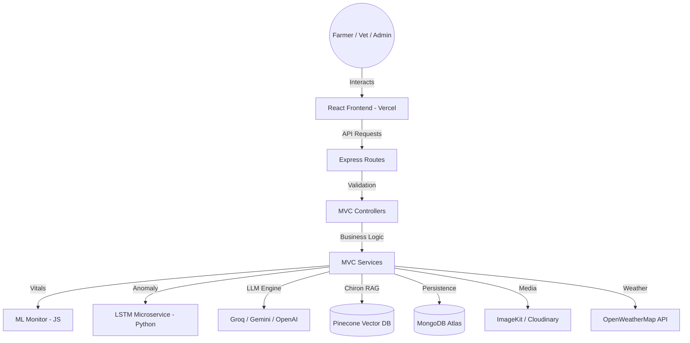

# AranyaAi — Because Instinct is Hidden. Protect Every Life, Before it Fails.

> **"Predict health risks before they manifest. Expert care for every pet and farm."**

AranyaAi is a mission-driven, full-stack intelligence platform designed to bridge the gap between animal instinct and human intervention. By combining high-precision LSTM Autoencoders for anomaly detection with multi-engine conversational AI and a veterinary RAG knowledge base (Chiron Intelligence), we empower farmers and veterinarians to safeguard livestock and pets with data before symptoms even surface.

[](https://aranyaai.vercel.app)
[](https://github.com/jainayush02/AranyaAI)
[](https://www.pinecone.io/)

---

## 🏗️ System Architecture (Restored MVC)

The platform follows a high-performance **MVC (Controller-Service-Route)** architecture, optimized for serverless deployment on Vercel.



---

## ✨ Core Features

### 🧠 Predictive Health Intelligence
Our LSTM Autoencoder model analyzes temperature, heart rate, and activity patterns to detect subtle anomalies that the human eye might miss. Get real-time alerts before symptoms even surface.

### 🔬 Chiron Intelligence (RAG)
A professional-grade veterinary knowledge engine. Upload clinical documents, embed them into a Pinecone vector database, and get AI-grounded answers backed by your own verified medical data — not hallucinated internet content.

### 💬 Arion — Advanced Chat
A multi-engine conversational assistant with **Global Search**, secure **Message Pinning**, and user-specific **Reaction Toggling**.

### 🛡️ Admin Portal
A powerful control center for managing AI engine configuration, system prompts, user management, and platform analytics. Includes **Herd Intelligence** for batch-reanalyzing health status.

### 📊 Real-time Dashboard & Weather
A sleek dashboard with interactive charts and vital monitoring. Includes a backend **Weather Proxy** (OpenWeatherMap) for integrated environmental context.

### 🔐 Enterprise-Grade Security
Professional Google Cloud Branding for trusted login, multi-channel OTP (Email & SMS), forgot password recovery, JWT-based session management, and dynamic CORS protection.

### 💳 Subscription & Billing
Integrated Razorpay payment gateway with configurable subscription plans managed from the Admin Portal.

### 📱 Medical Vault & Health Records
Secure archive for health records. Supports **Bulk Health Logging** for rapid ingestion of historical diagnostic data.

---

## 🏗️ Modern Tech Stack

| Layer | Technology |
| :--- | :--- |
| **Frontend** | React 18, Vite, Framer Motion, Recharts, React Markdown, Lucide Icons |
| **Backend** | Node.js, Express, JWT, Mongoose, Multer, SSE Streaming |
| **AI Diagnostic** | Python, Flask, TensorFlow (LSTM Autoencoder), Scikit-learn |
| **Conversational AI** | Multi-Engine: Groq (Qwen), Google Gemini (Fallback) via OpenAI-compatible API |
| **RAG Pipeline** | Pinecone Vector DB, Sentence Embeddings, Cosine Similarity Retrieval |
| **Database** | MongoDB Atlas |
| **Identity** | Google Identity Services, OTP (Twilio SMS + Nodemailer Email) |
| **Payments** | Razorpay Payment Gateway |
| **Media** | ImageKit CDN |
| **Hosting** | Vercel (Frontend + Backend) · Render (Python AI Microservice) |

---

## 📂 Repository Architecture

```text
AranyaAi/
├── src/
│   ├── client/                    # React Frontend (Vite)
│   │   ├── src/
│   │   │   ├── components/        # Reusable UI Components
│   │   │   │   ├── ChatBot.jsx        # Arion AI Chat (SSE Streaming)
│   │   │   │   ├── Layout.jsx         # Sidebar Navigation Shell
│   │   │   │   ├── AddAnimalDialog.jsx
│   │   │   │   ├── EditAnimalDialog.jsx
│   │   │   │   ├── ConfirmDialog.jsx
│   │   │   │   ├── UserProfileMenu.jsx
│   │   │   │   ├── GenerativeArt.jsx
│   │   │   │   └── ToastProvider.jsx
│   │   │   └── pages/             # Route-Specific Views
│   │   │       ├── Login.jsx          # Landing Page + Auth (Google SSO, OTP)
│   │   │       ├── Dashboard.jsx      # Real-time Health Overview
│   │   │       ├── AnimalProfile.jsx  # Individual Animal Management
│   │   │       ├── AdminPortal.jsx    # Admin Control Center
│   │   │       ├── ChironIntelligence.jsx  # RAG Document Management
│   │   │       ├── Profile.jsx        # User Profile & Settings
│   │   │       ├── Settings.jsx       # Application Preferences
│   │   │       ├── Billing.jsx        # Subscription & Payment
│   │   │       ├── Calendar.jsx       # Health Event Calendar
│   │   │       ├── Docs.jsx           # Knowledge Base Articles
│   │   │       └── HelpCenter.jsx     # Support & FAQ
│   │   ├── vite.config.js         # Build & Proxy Configuration
│   │   └── package.json
│   └── server/                    # Node.js Backend
│       ├── routes/                # Route Definitions (Express)
│       │   ├── auth.js
│       │   ├── animals.js
│       │   ├── chat.js
│       │   ├── admin.js
│       │   ├── plans.js
│       │   ├── docs.js
│       │   └── chiron.js
│       ├── controllers/           # Route Handlers (REST Logic)
│       │   ├── auth.controller.js
│       │   ├── animals.controller.js
│       │   └── chat.controller.js
│       ├── services/              # Pure Business Logic & AI
│       │   ├── auth.service.js
│       │   ├── animals.service.js
│       │   └── chat.service.js
│       ├── models/                # Mongoose Schemas (Data)
│       │   ├── User.js
│       │   ├── Animal.js
│       │   ├── ChatMessage.js
│       │   ├── Conversation.js
│       │   ├── ChironDocument.js
│       │   ├── MedicalRecord.js
│       │   ├── HealthLog.js
│       │   ├── Plan.js
│       │   ├── DocArticle.js
│       │   ├── ActivityLog.js
│       │   └── SystemSettings.js
│       ├── utils/                 # VitalMonitor, Notifications, Cloudinary
│       ├── ai_model/              # Python AI Microservice (LSTM)
│       └── server.js              # Entry Point
├── scripts/                    # Utility Scripts
│   ├── kill_all.ps1               # Stop all services (Windows)
│   ├── kill_all.sh                # Stop all services (Linux/macOS)
│   ├── push.sh                    # Git push helper
│   └── push.ps1                   # Git push helper (Windows)
├── start_all.py                   # One-Click Dev Launcher
└── vercel.json                    # Deployment Configuration
```

---

## 🚀 Getting Started

Setting up AranyaAi locally takes less than 10 minutes.

### 1. Requirements
Ensure you have **Node.js (v18+)**, **Python (v3.10+)**, and a **MongoDB Atlas** cluster ready.

### 2. Quick Install
```bash
# Clone the repository
git clone https://github.com/jainayush02/AranyaAI.git && cd AranyaAI

# Install Frontend dependencies
cd src/client && npm install

# Install Backend dependencies
cd ../server && npm install

# Initialize the AI Microservice
cd ai_model
python -m venv venv
# Activate venv (Windows: venv\Scripts\activate | Mac/Linux: source venv/bin/activate)
pip install -r requirements.txt
```

### 3. Environment Configuration
Create a `.env` file in `src/server/` with the following variables:
```env
PORT=5000
MONGO_URI=your_mongodb_connection_string
JWT_SECRET=your_jwt_secret
CLIENT_URL=http://localhost:5173

# AI Engines (Configured via Admin Portal)
GROQ_API_KEY=your_groq_api_key
GEMINI_API_KEY=your_gemini_api_key

# Pinecone Vector Database (Chiron Intelligence)
PINECONE_API_KEY=your_pinecone_api_key

# Google OAuth
GOOGLE_CLIENT_ID=your_google_client_id

# Email Notifications
GOOGLE_EMAIL_USER=your_email_address
GOOGLE_EMAIL_PASS=your_email_app_password

# SMS Notifications
TWILIO_ACCOUNT_SID=your_twilio_sid
TWILIO_AUTH_TOKEN=your_twilio_auth_token
TWILIO_PHONE_NUMBER=your_twilio_phone_number

# Payments
RAZORPAY_KEY_ID=your_razorpay_key_id
RAZORPAY_KEY_SECRET=your_razorpay_key_secret

# Media Storage
IMAGEKIT_PUBLIC_KEY=your_imagekit_public_key
IMAGEKIT_PRIVATE_KEY=your_imagekit_private_key
IMAGEKIT_URL_ENDPOINT=your_imagekit_url_endpoint
```

### 4. Zero-Click Startup
From the project root, run our custom one-click launcher:
```bash
python start_all.py
```
This will automatically start:
- ✅ Node.js Backend (Port 5000)
- ✅ React Frontend (Port 5173)
- ✅ Python AI Microservice (Port 8005)

---

## 🔧 AI Engine Configuration

AranyaAi uses a **configuration-first** approach. All AI engine settings are managed through the **Admin Portal** — no code changes required.

| Setting | Description |
| :--- | :--- |
| **Primary Engine** | The main LLM used for chat (e.g., Groq with Qwen model) |
| **Fallback Engine** | Backup LLM when the primary hits rate limits (e.g., Google Gemini) |
| **System Prompts** | Custom prompts for Aranya (Search) and Chiron (Clinical) modes |
| **RAG Top-K** | Number of knowledge base documents retrieved per Chiron query |
| **Discovery Velocity** | Batch size for document embedding during Chiron ingestion |

---

## 📄 License

This project is proprietary software. See the [LICENSE](LICENSE) file for full terms. Cloning is permitted for educational review only — deployment, modification, and redistribution are strictly prohibited without written permission from Aranya AI.

---

<p align="center">Built with ❤️ by <strong>Ayush Jain, Anu Gudi, Ankit Verma, and Keya Gaosandhe </strong></p>
