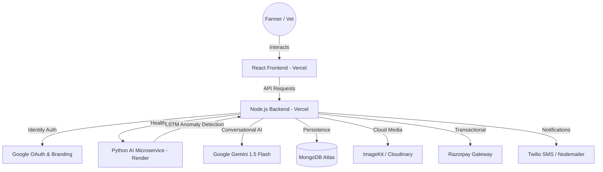

# AranyaAi — Because Instinct is Hidden. Protect Every Life, Before it Fails.

> **"Predict health risks before they manifest. Expert care for every pet and farm."**

AranyaAi is a mission-driven, full-stack intelligence platform designed to bridge the gap between animal instinct and human intervention. By combining high-precision LSTM Autoencoders for anomaly detection with the conversational intelligence of Gemini AI, we empower farmers and veterinarians to safeguard livestock and pets with data before symptoms even surface.

[](https://aranyaai.vercel.app)
[](https://github.com/jainayush02/AranyaAI)

---

## 🏗️ System Architecture

Our architecture is designed for high-throughput health monitoring and low-latency diagnostic feedback. It leverages a microservices-inspired approach to separate real-time data processing from AI inference.



---

## ✨ Why AranyaAi?

Most livestock health issues are caught only after physical symptoms appear—at which point it’s often too late. AranyaAi shifts the paradigm from *Reactive* to **Predictive**.

- **🧠 LSTM-Powered Diagnostics**: Our model analyzes temperature, heart rate, and activity patterns to detect subtle anomalies that the human eye might miss.
- **💬 Arion — The AI Companion**: A Gemini-powered assistant that understands veterinary context, helping you interpret data and manage farm tasks.
- **🛡️ Enterprise-Grade Security**: Professional Google Cloud Branding for a trusted login experience, protected by dynamic CORS and multi-channel OTP.
- **📊 Real-time Oversight**: A sleek, glassmorphic dashboard that provides a "single source of truth" for your farm's health and revenue.

---

## 🏗️ Modern Tech Stack

| Layer | Technology |
| :--- | :--- |
| **Frontend** | React 18, Framer Motion, Recharts, Lucide Icons |
| **Backend** | Node.js, Express 5, JWT, Mongoose, Multer |
| **AI Diagnostic** | Python, Flask, TensorFlow (LSTM Autoencoder) |
| **Intelligence** | Google Gemini 1.5 Flash |
| **Database** | MongoDB Atlas (Cloud Vector-capable) |
| **Identity** | Google Identity Services & Cloud Auth Branding |
| **Hosting** | Vercel (Web) · Render (AI Inference) |

---

## 📂 Repository Architecture

AranyaAi is structured to separate concerns between user experience, business logic, and predictive intelligence.

```text
AranyaAi/
├── src/
│   ├── client/                  # React Frontend (Vite)
│   │   ├── src/                 # Core logic: App.jsx, main.jsx
│   │   │   ├── components/      # Reusable UI components
│   │   │   └── pages/           # Route-specific views (Dashboard, Login)
│   │   ├── vite.config.js       # Build & Proxy configuration
│   │   └── package.json         # Frontend dependencies
│   └── server/                  # Node.js Backend
│       ├── routes/              # API Endpoints (auth.js, animals.js, chat.js)
│       ├── models/              # Mongoose Schemas (User.js, Animal.js)
│       ├── utils/               # Loggers, Vital Monitoring & Notifications
│       ├── ai_model/            # Python/Flask LSTM Diagnostic Engine
│       │   └── ai_server.py     # Main Flask server for LSTM inference
│       └── server.js            # Express application entry point
├── start_all.py                 # Integrated One-Click Launcher for dev
└── vercel.json                  # Production-ready Deployment Config
```

---

## 🚀 Getting Started

Setting up AranyaAi locally takes less than 10 minutes.

### 1. Requirements
Ensure you have **Node.js (v18+)**, **Python (v3.10+)**, and a **MongoDB Atlas** cluster ready.

### 2. Quick Install
```bash
# Clone the repository
git clone https://github.com/jainayush02/AranyaAI.git && cd AranyaAI

# Install all dependencies (Frontend & Backend)
cd src/client && npm install
cd ../server && npm install

# Initialize the AI Microservice
cd ai_model
python -m venv venv
# Activate venv & install (Windows: venv\Scripts\activate)
pip install -r requirements.txt
```

### 3. Environment Configuration
Create a `.env` file in `src/server/` with the following:
```env
PORT=5000
MONGO_URI=your_mongodb_cluster_uri
JWT_SECRET=your_secure_secret
CLIENT_URL=http://localhost:5173

# AI & Messaging
GEMINI_API_KEY=your_key
TWILIO_ACCOUNT_SID=your_sid
GOOGLE_CLIENT_ID=your_google_auth_id
GOOGLE_EMAIL_USER=your_email@gmail.com
GOOGLE_EMAIL_PASS=your_app_password
```

### 4. Zero-Click Startup
From the project root, run our custom one-click launcher:
```bash
python start_all.py
```

## 📄 License

This project is for educational and portfolio purposes.

---

<p align="center">Built with ❤️ by <strong>Ayush Jain, Anu Gudi, Ankit Verma, and Keya Goashande </strong></p>
